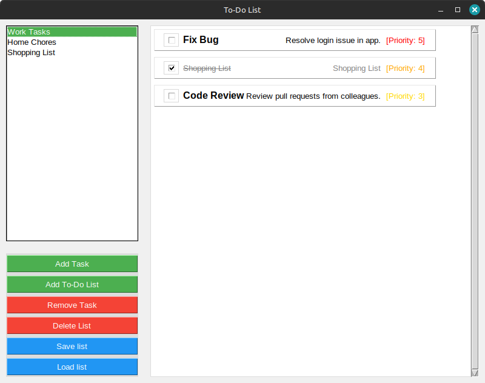

# To-Do List Application (v2 GUI)

A to-do list manager with a Tkinter GUI, built to learn GUI development after a CLI v1. Supports multiple lists, task priorities, completion toggles, and CSV import/export.

## Features
- GUI with listbox for selecting to-do lists
- Scrollable task display: sorted by priority (1-5, color-coded), checkboxes for completion, task details
- Popups for adding/removing tasks/lists, saving/loading CSV files
- Tasks include title, description, priority, and completion status

## Screenshot
 

## Requirements
- Python 3.6+
- Tkinter (pre-installed with most Python distributions; install via `pip install tk` if needed)

## Usage
1. Clone this repository:
   ```sh
   git clone https://github.com/hosseingarosian09-lab/TodoList-.git
   cd TodoList-
   ```
2. Run the application:
   ```sh
   python Tkinter_UI.py
   ```
3. Use buttons to manage lists and tasks via popups.

## File Structure
- `Tkinter_UI.py` — Main GUI interface
- `todolist.py` — `todolist` and `task` classes

## Notes
- Limitation: Only one list can be focused at a time for task edits.
- CSV files are saved/loaded in the current directory.

## Getting Started
Clone the repo, ensure Tkinter is installed, and run `Tkinter_UI.py`. Example: Create a list, add a task ("Meeting", "Team sync", Priority 3), toggle completion, save to CSV.

## About
First project by Hossein Garossian. Feedback on GUI or features welcome!